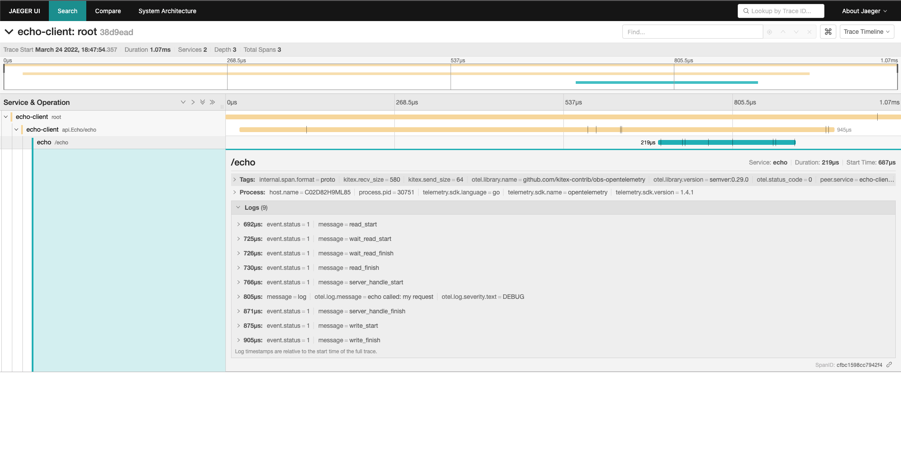

# Opentelemetry Example

## HOW-TO-RUN
1. install docker
2. run opentelemetry-collector、jaeger、victoriametrics、grafana: `docker-compose up -d`
4. run Kitex server: `go run server/main.go`
5. run Kitex client: `go run client/main.go`

## MONITORING

## View Trace
You can then navigate to http://localhost:16686 to access the Jaeger UI. (You can visit Monitor Jaeger for details)


## View Metrics
You can then navigate to http://localhost:3000 to access the Grafana UI. (You can visit Monitor Grafana for metrics)

### add datasource

URL: `http://host.docker.internal:8428/`


### add a dashboard and a panel

### support metrics 
- RPC Metrics
- Runtime Metrics

## Tracing associated Logs

#### set logger impl
```go
import (
    "github.com/kitex-contrib/obs-opentelemetry/logging/kitexlogrus"
)

func init()  {
    klog.SetLogger(kitexlogrus.NewLogger())
    klog.SetLevel(klog.LevelDebug)

}
```

#### log with context

```go
// Echo implements the Echo interface.
func (s *EchoImpl) Echo(ctx context.Context, req *api.Request) (resp *api.Response, err error) {
	klog.CtxDebugf(ctx, "echo called: %s", req.GetMessage())
	return &api.Response{Message: req.Message}, nil
}
```

#### view log

```log
{"level":"debug","msg":"echo called: my request","span_id":"056e0cf9a8b2cec3","time":"2022-03-09T02:47:28+08:00","trace_flags":"01","trace_id":"33bdd3c81c9eb6cbc0fbb59c57ce088b"}
```
